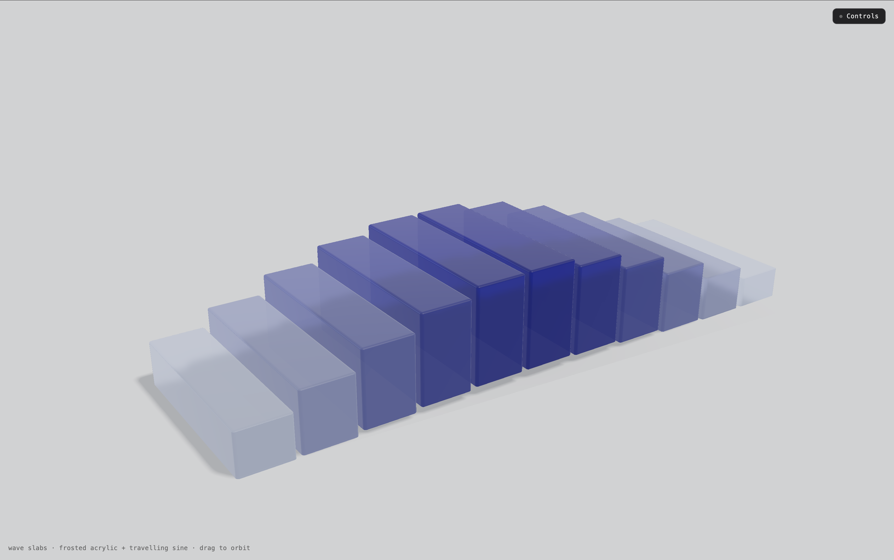

# Lab__Breathing-box

A WebGL study of **frosted acrylic slabs** rising and falling in a travelling sine wave — like a row of breathing boxes.

Built with [Three.js](https://threejs.org/) `r160`, `lil-gui`, `RoundedBoxGeometry`, and a VSM-blurred shadow pass. Every parameter is live-tunable from the in-browser control panel.



---

## Demo

Open `index.html` directly in a modern browser, or serve the folder:

```bash
npx serve .
# or
python3 -m http.server 8080
```

Then visit `http://localhost:8080`.

---

## Controls

Press **H** or click the **Controls** button (top-right) to toggle the panel.

| Folder | Params | Notes |
|---|---|---|
| **Layout** | `count`, `slabWidth`, `slabDepth`, `gap` | Rebuilds geometry on change |
| **Wave** | `baseHeight`, `amplitude`, `frequency`, `phaseStep`, `rotateSway` | Travelling sine wave shape |
| **Material** | `colorBase`, `colorAccent`, `opacity`, `transmission`, `roughness` | `MeshPhysicalMaterial` with transmission |
| **Light & FX** | `ambient`, `keyLight`, `fillLight`, `bloom` | UnrealBloom post-pass |
| **Shadow** | `enabled`, `softness`, `blur`, `bias`, `opacity` | VSM shadow map + contact shadow |
| **Floor** | `floorRoughness`, `floorReflection`, `envIntensity` | Tame the reflection to reveal shadows |

---

## Tech notes

### Transmission shadows
`MeshPhysicalMaterial` with `transmission > 0` skips Three.js's depth pass, so the slabs cast no shadow by default. Workaround:

```js
mesh.customDepthMaterial = new THREE.MeshDepthMaterial({
  depthPacking: THREE.RGBADepthPacking,
});
```

### Soft shadow blur
Switched from `PCFSoftShadowMap` to `VSMShadowMap` so that `key.shadow.radius` and `key.shadow.blurSamples` produce real Gaussian falloff rather than PCF tap noise.

### Travelling wave
Each slab's phase is offset by its index:

```js
const phase = t * frequency * Math.PI * 2 - index * phaseStep;
const rise  = (Math.sin(phase) + 1) * 0.5;
mesh.scale.y   = baseHeight + rise * amplitude;
mesh.position.y = mesh.scale.y * 0.5 + Math.sin(phase) * 0.06;
```

### Color interpolation
Each slab's base color is a distance-weighted lerp from `colorBase` (edges) to `colorAccent` (center), then modulated per-frame by its wave `rise`.

---

## File

- `index.html` — everything (imports, scene, shaders, GUI). Single-file demo.

---

## License

MIT © [Touch-Moon](https://github.com/Touch-Moon)
